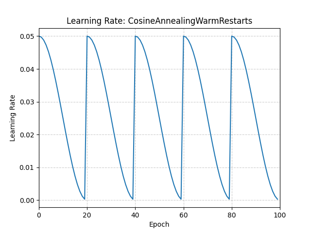

# LR Scheduler

## Cosine Annealing Warm Restarts

The learning rate of each parameter group is updated using a **cosine annealing schedule with warm restarts**.

The maximum learning rate $\eta_{\max}$ is set to the initial learning rate.  
$T_{\text{cur}}$ represents the number of epochs since the last restart, while $T_i$ is the number of epochs between two consecutive warm restarts.

The learning rate is computed as:

```math
\eta_t = \eta_{\min} +
\frac{1}{2}
(\eta_{\max} - \eta_{\min})
\left(
1 + \cos\left(\frac{T_{\text{cur}}}{T_i}\pi\right)
\right)
```

When $T_{\text{cur}} = T_i$:

```math
\eta_t = \eta_{\min}
```

After a restart, when $T_{\text{cur}} = 0$:

```math
\eta_t = \eta_{\max}
```

This scheduling strategy was proposed in  
[**SGDR: Stochastic Gradient Descent with Warm Restarts**](https://arxiv.org/abs/1608.03983).

#### Parameters

- **`optimizer`** ([`Optimizer`](https://docs.pytorch.org/docs/2.14/optim.html#torch.optim.Optimizer))  
  Wrapped optimizer.

- **`T_0`** (`int`)  
  Number of iterations until the first restart.

- **`T_mult`** (`int`, optional)  
  Factor by which $T_i$ increases after each restart.  
  Default: `1`.

- **`eta_min`** (`float`, optional)  
  Minimum learning rate.  
  Default: `0`.

- **`last_epoch`** (`int`, optional)  
  Index of the last epoch.  
  Default: `-1`.

<p align="center">
  
</p>

> Adapted from the PyTorch documentation for
> [`torch.optim.lr_scheduler.CosineAnnealingWarmRestarts`](https://docs.pytorch.org/docs/2.14/generated/torch.optim.lr_scheduler.CosineAnnealingWarmRestarts.html).