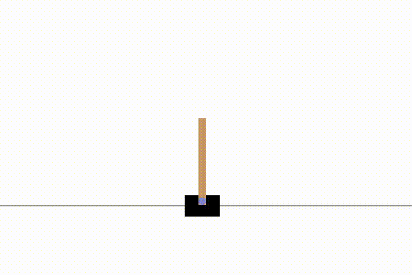
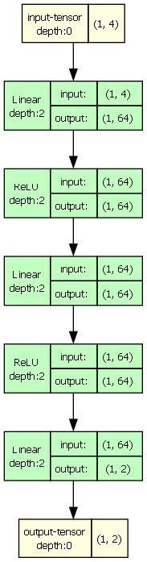

# DQL on CartPole

<table>
    <tr>
        <td align="center">
            <b>Early Training</b>
        </td>
        <td></td>
        <td align="center">
            <b>After Training</b>
        </td>
    </tr>
    <tr>
        <td align="center">
            
        </td>
        <td align="center">
            
        </td>
        <td align="center">
            
        </td>
    </tr>
</table>

## The training

Training time : 2m39s

Used Technologies :
- **Adam** Optimizer
- **MSE** Loss
- [**CosineAnnealingWarmRestarts** Scheduler](../../technologies/lr_scheduler.md)

<table>
    <tr>
        <td align="center">
            
        </td>
        <td align="center">
            
        </td>
    </tr>
</table>

<table>
    <tr>
        <td align="center">
            
        </td>
        <td align="center">
            
        </td>
    </tr>
</table>

## The model

The model used is a dense neural network made with torch.nn modules

  

## Hyperparameters

The following hyperparameters were used for training the DQN agent.

### Environment

| Parameter | Value |
|---|---:|
| Environment | `CartPole-v1` |

### Model

| Parameter | Value |
|---|---:|
| Hidden size | `64` |
| Save model | `True` |
| Load model | `True` |
| Model path | `./runs/CartPole-v1/run_4413/models/model_episode_1600_score_500.00.pth` |

### Training

| Parameter | Value |
|---|---:|
| Number of episodes | `10000` |
| Evaluation episodes | `3` |
| Evaluation interval | `100` |
| Initial epsilon | `1.0` |
| Epsilon decay | `0.999` |
| Minimum epsilon | `0.01` |
| Learning rate | `1e-2` |
| Discount factor $\gamma$ | `0.99` |
| Training steps | `10` |

### Replay Buffer

| Parameter | Value |
|---|---:|
| Capacity | `1000` |
| Batch size | `64` |